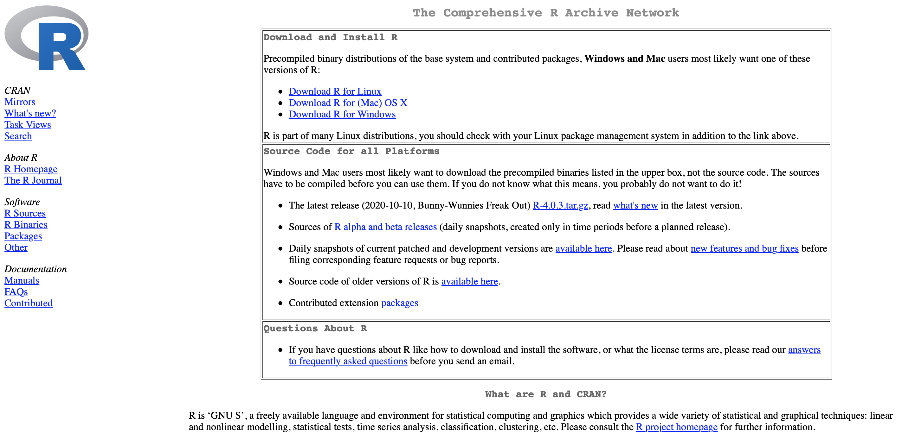
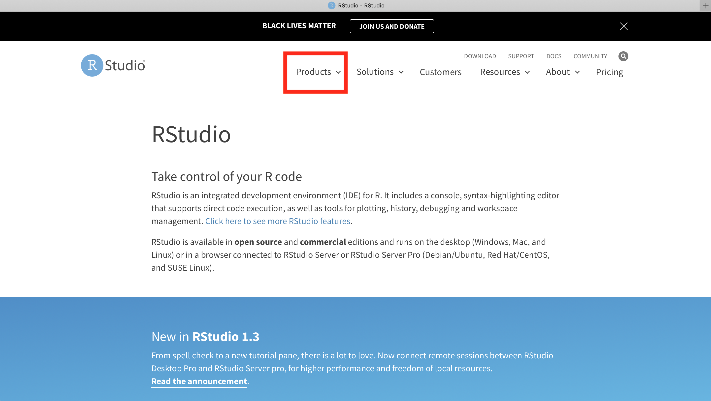
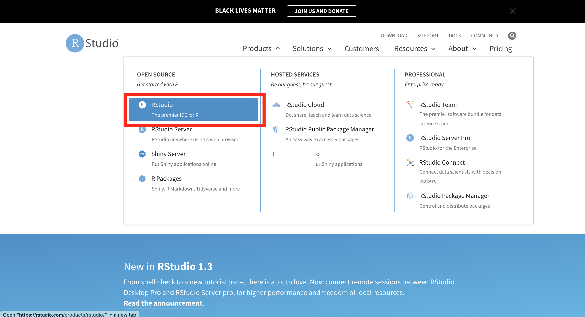
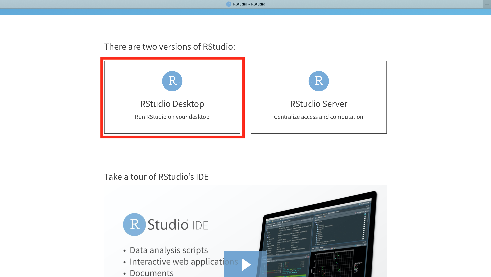
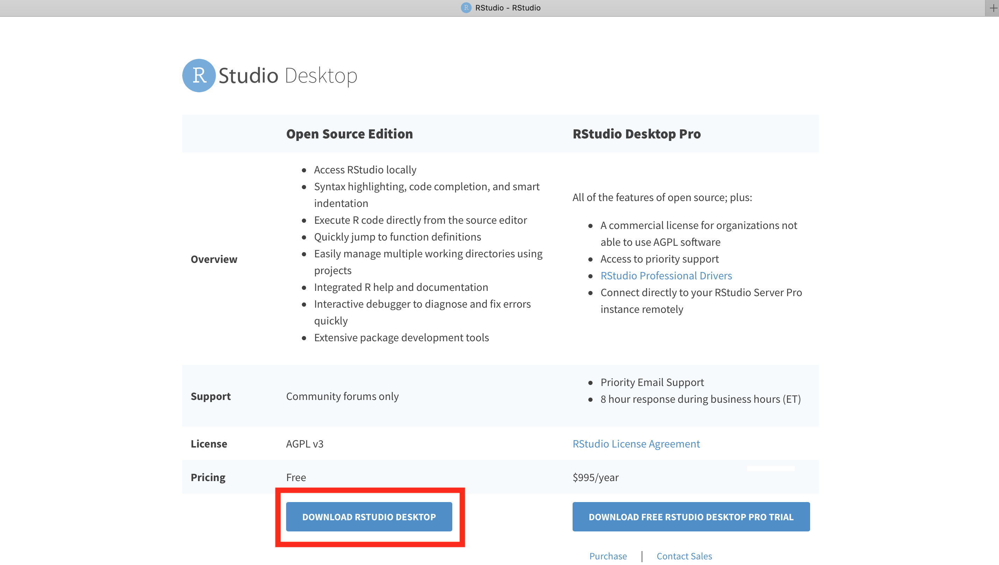
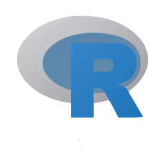
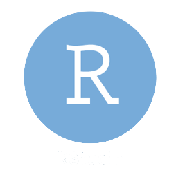

# Installing R and R Studio

To use R on your machine you will need to download and install both it and RStudio. R is the 'engine', the statistical software that actually does all the data manipulation and calculations, while RStudio is the 'IDE', or 'Integrated Development Environment'. It is the application through which you actually use R. While it is not necessary to use RStudio, doing so makes using R so much easier that pretty much everyone uses it now, and I advise you to do so too.

### Getting R

Download it from the CRAN page at

```
cloud.r-project.org
```



Click on  the appropriate download link for your operating system and follow the installation instructions.


### Getting RStudio

Do this _after_ you have downloaded R. 

Download it from
```
https://rstudio.com/products/rstudio/
```

When you are there, click on Products


then on RStudio


then RStudio Desktop...


then download the Open Source Edition

and finally follow the installation instructions, appropriate for your machine.

### What to open and what not to open

Once the download and installations are complete, you will see these icons on your machine:

 

__Never__ open the __R__ icon (left), _always_ open the __R Studio__ icon (right).

